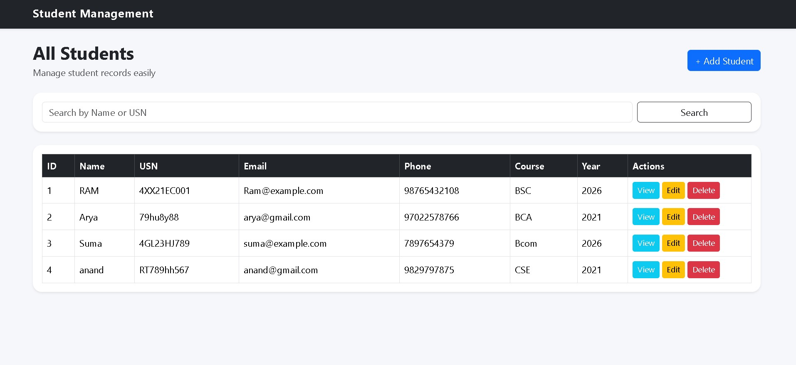
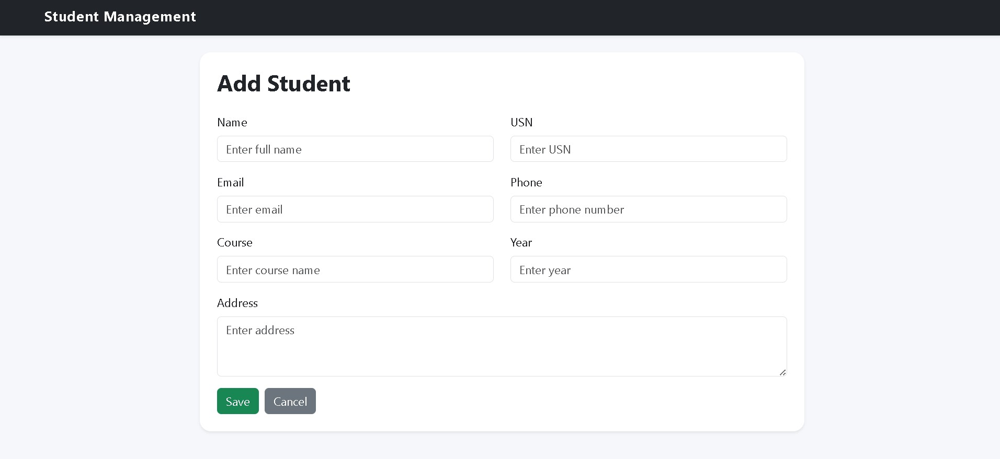
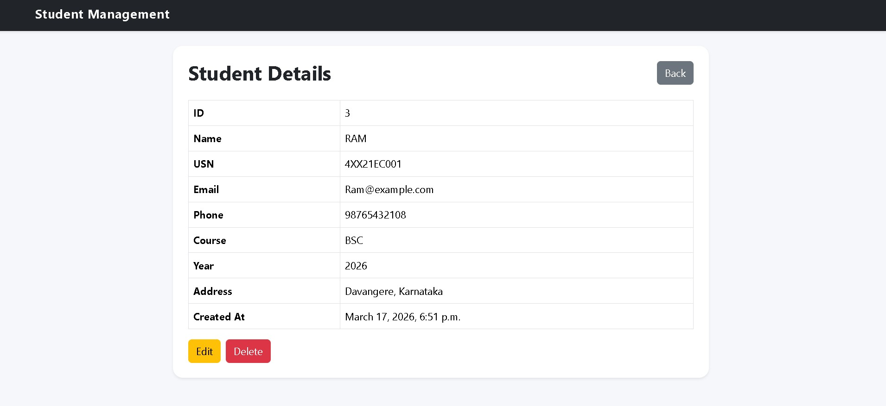
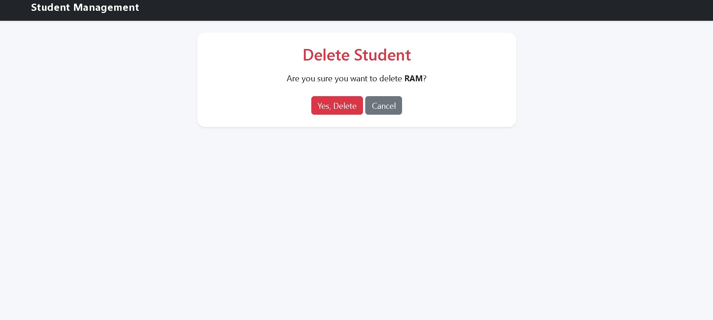
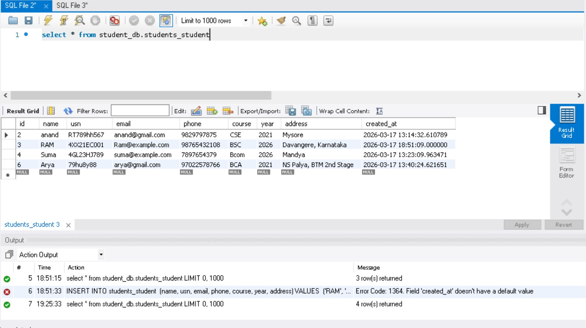
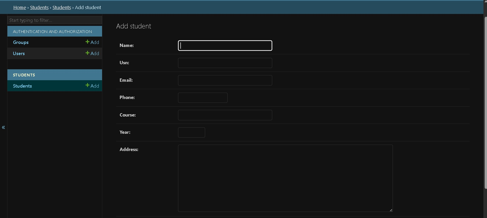

# Student Management System

A full-stack web application built using Django, MySQL, and Bootstrap to manage student records.

## Features
- Add, Edit, Delete Students
- Search by Name or USN
- Pagination
- Student Detail Page
- Form Validation
- Responsive UI (Bootstrap)

## Tech Stack
- Python
- Django
- MySQL
- HTML, CSS, Bootstrap

## Setup Instructions

1. Clone repository
2. Create virtual environment
3. Install dependencies:
   pip install -r requirements.txt
4. Configure MySQL in settings.py
5. Run migrations:
   python manage.py migrate
6. Start server:
   python manage.py runserver
## Screenshots

### Home Page

  

### Add Student

  

### Student Detail

  

### Delete Student

  

### Data Base

  

### Admin

  

## Author
Jeevan N R
